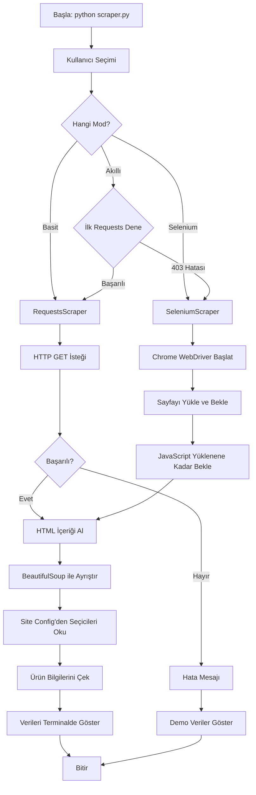

# Sistem Mimarisi ve Desenleri

## 1. Genel Sistem Mimarisi

Proje, başlangıçta basit tek betikli yapıdan, **hibrit modüler mimariye** geçiş yapıyor. Bu yeni mimari, hem basit HTTP isteklerini hem de gelişmiş tarayıcı otomasyonunu destekleyecek şekilde tasarlandı.

### Güncel Akış Diyagramı (Hibrit Mimari)



### Yeni Dosya ve Modül Yapısı

```
E-commerce Product Scraper/
├── scraper.py              # Ana giriş noktası, kullanıcı arayüzü
├── scrapers/               # Scraper modülleri
│   ├── __init__.py
│   ├── base_scraper.py     # Abstract base class
│   ├── requests_scraper.py # Basit HTTP (mevcut mantık)
│   └── selenium_scraper.py # Tarayıcı otomasyon
├── config/
│   └── sites_config.json   # Site-spesifik CSS seçiciler
├── memory-bank/            # Teknik dokümantasyon
│   └── selenium_integration_plan.md
├── requirements.txt
├── projectbrief.md
├── activeContext.md
└── README.md
```

## 2. Uygulanan Tasarım Desenleri

Selenium entegrasyonu ile birlikte, proje daha profesyonel yazılım tasarım desenlerini kullanmaya başlıyor:

### Strateji Deseni (Strategy Pattern)
- **Amaç:** Farklı kazıma stratejilerini (Requests vs Selenium) değiştirilebilir kılmak.
- **Uygulama:** 
  - `BaseScraper` soyut sınıfı ortak arayüzü tanımlar.
  - `RequestsScraper` ve `SeleniumScraper` bu arayüzü implement eder.
  - Ana program, runtime'da hangi stratejiyi kullanacağına karar verir.

### Fabrika Deseni (Factory Pattern)
- **Amaç:** Hangi scraper türünün oluşturulacağını merkezi bir noktadan yönetmek.
- **Uygulama:** `ScraperFactory.create(mode, site)` metodu uygun scraper'ı döner.

### Yapılandırma Deseni (Configuration Pattern)
- **Amaç:** Site-spesifik ayarları koddan ayırmak.
- **Uygulama:** `sites_config.json` dosyası her site için CSS seçiciler ve diğer parametreleri tutar.

### Geri Düşme Deseni (Fallback Pattern)
- **Amaç:** Bir yöntem başarısız olduğunda alternatif yola geçmek.
- **Uygulama:** 
  - Akıllı mod: İlk önce Requests, başarısız olursa Selenium.
  - Veri çekme: Gerçek veri çekilemezse demo veri göster.

## 3. Kalıcı Teknik Kararlar

- **Modüler Yapıya Geçiş:** Tek dosyadan (`scraper.py`) çoklu modül yapısına (`scrapers/` klasörü) geçiş yapıldı. Bu, kod organizasyonunu iyileştirir ve yeni scraper türlerinin eklenmesini kolaylaştırır.
- **Bağımlılık Yönetimi:** Yeni bağımlılıklar eklendi (`selenium`, `webdriver-manager`) ancak projenin hafif kalması için gereksiz paketlerden kaçınıldı.
- **Yapılandırma Dosyaları:** Site-spesifik ayarlar (URL, CSS seçiciler) JSON dosyasına taşındı. Bu, kodda değişiklik yapmadan yeni siteler eklemeyi sağlar.
- **Geriye Uyumluluk:** Basit Requests modu korundu. Kullanıcılar hala hafif ve hızlı temel scraping'i kullanabilir.
- **Chrome WebDriver Otomasyonu:** `webdriver-manager` kullanarak driver dosyalarını otomatik indirme ve güncelleme. Kullanıcıdan manuel driver kurulumu istenmez.

## 4. Bileşen Etkileşimleri

Yeni hibrit mimari ile bileşenler arası etkileşim karmaşıklaştı:

### İçsel Etkileşimler (Modüller Arası):
- **`scraper.py` (Main) ↔ `ScraperFactory`:** Kullanıcı seçimine göre uygun scraper instance'ı talep eder.
- **`ScraperFactory` → `RequestsScraper` veya `SeleniumScraper`:** İlgili scraper sınıfını oluşturur.
- **`RequestsScraper` → `requests` kütüphanesi:** HTTP GET istekleri yapar.
- **`SeleniumScraper` → `selenium.webdriver`:** Chrome tarayıcısını kontrol eder.
- **Her Scraper → `BeautifulSoup`:** HTML ayrıştırma için ortak parser.
- **Her Scraper → `sites_config.json`:** CSS seçicileri ve site ayarlarını okur.

### Dışsal Etkileşimler (Sistem Dışı):
- **`RequestsScraper` → Hedef Web Sunucusu:** Basit HTTP isteği.
- **`SeleniumScraper` → Chrome WebDriver → Gerçek Chrome Tarayıcı → Hedef Web Sunucusu:** Tam tarayıcı simülasyonu.
- **Tüm Bileşenler → Terminal/Konsol:** Kullanıcıya çıktıları göster.
- **`webdriver-manager` → ChromeDriver Sunucusu:** Otomatik driver indirme.

### Veri Akışı:
```
Kullanıcı Input → ScraperFactory → [Requests|Selenium]Scraper 
    → Web Sitesi → HTML Response → BeautifulSoup 
    → Config Selectors → Parsed Data → Terminal Output
```
