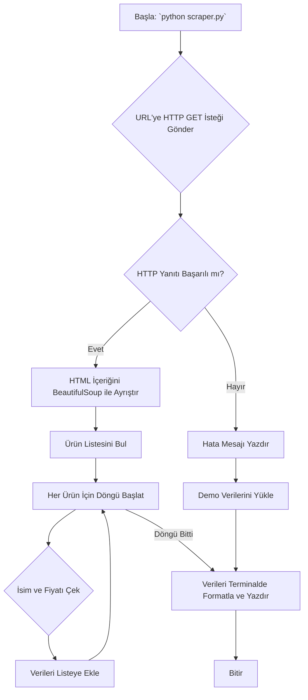

# Sistem Mimarisi ve Desenleri

## 1. Genel Sistem Mimarisi

Proje, basitliği ve eğitimsel odağı yansıtan tek betikli, doğrusal bir mimariye sahiptir. Herhangi bir harici veritabanı, sunucu veya karmaşık bileşen etkileşimi yoktur. Tüm işlemler tek bir `scraper.py` dosyası içinde gerçekleşir.

### Akış Diyagramı

## 2. Uygulanan Tasarım Desenleri

Bu projenin basit doğası gereği, karmaşık yazılım tasarım desenleri (Singleton, Factory, vb.) bilinçli olarak kullanılmamıştır. Bunun yerine, temel ve anlaşılır programlama yapıları tercih edilmiştir:

- **Doğrusal Betik (Procedural Script):** Kod, yukarıdan aşağıya doğru adım adım çalışır. Bu, takip edilmesi en kolay yapıdır ve eğitim amaçları için idealdir.
- **Hata Durumunda Geri Düşme (Fallback):** Ana işlev (veri kazıma) başarısız olduğunda, program alternatif bir yola (demo verileri gösterme) sapar. Bu, `try...except` blokları ile basit bir şekilde uygulanır ve programın dayanıklılığını artırır.

## 3. Kalıcı Teknik Kararlar

- **Harici Bağımlılıkları Minimumda Tutma:** Proje, yalnızca endüstri standardı olan `requests` ve `BeautifulSoup4` kütüphanelerine dayanır. Bu, kurulumu basitleştirir ve "bağımlılık cehennemini" önler.
- **Durumsuz (Stateless) Çalışma:** Uygulama herhangi bir durumu (state) veya veriyi oturumlar arasında saklamaz. Her çalıştırma, sıfırdan başlayan bağımsız bir işlemdir. Bu, öngörülebilirliği artırır ve hata ayıklamayı kolaylaştırır.

## 4. Bileşen Etkileşimleri

Sistem tek bir bileşenden (`scraper.py`) oluştuğu için dahili bileşen etkileşimi yoktur. Dış dünya ile olan etkileşimler şunlardır:

- **`scraper.py` -> Hedef E-ticaret Sunucusu:** HTTP GET isteği gönderir.
- **Hedef E-ticaret Sunucusu -> `scraper.py`:** HTML yanıtı döner.
- **`scraper.py` -> Terminal:** Formatlanmış ürün verilerini veya hata mesajlarını yazdırır.
